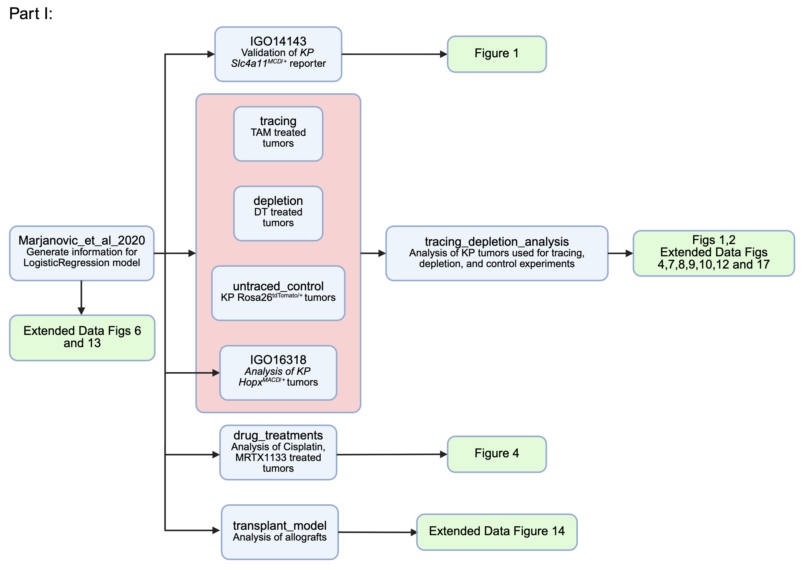

# HPCS_LUAD
Code base to analyze data from "Critical role for a high-plasticity cell state in lung cancer" by Chan*, Pan* et. al. 

The code base has a permenant home located at [https://github.com/dbetel/HPCS_LUAD](https://github.com/dbetel/HPCS_LUAD)

_Requirements_: SCANPY, AnnData, Scipy, Palantir, Cellrank v2
(note all package dependencies and versions are located within the Conda yml files)

## Part 1 - Processing of 10x Single Cell Mouse Sequencing Data (recommended to run these in the order shown).

All generated sequencing data and count matrices are available at the NCBI Gene Expression Omnibus under accession record GSE277777.

Note: the original code for Part 1 was run on an Intel OS X 64-bit architecture. To recreate the figures, statistics, and cluster labeling for Part 1 will require a native Intel 64-bit OS X installation; use the Part1.osx64-native.yml file below.

_Part1.osx64-native.yml_ - Conda package list used to analyze data from Part 1. Use "conda env create -f Part1.osx64-native.yml" to recreate the environment used to analyze the data in this section.  Data was originally run in a conda environment in a Intel 64-bit Mac OS X environment. Note: Rosetta emulation is incompatible with Palantir within the Marjanovic_et_al_2020/02_Marjanovic.ipynb notebook due to underlying library requirements; there will also be slight differences between cluster labels necessitating manual intervention and evaluation in other notebooks.

_Part1.other.yml_ - Conda package that will allow installation on Apple Silicon and Linux machines. Use "conda env create -f Part1.other.yml" to recreate the environment. Differences may occur between cluster generation and labeling due to differences in the default calculations for the underlying packages and manual intervention and analysis will be required.

**_Marjanovic\_et\_al\_2020_** - Contains the Jupyter notebook to process the data from Marjanovic*, Hofree*, Chan* et al., Cancer Cell 2020. A prerequisite to classify the cell states required to generate the figures in the paper. Creates data for Extended Data Fig. 4 and 8. Note: the original data was analyzed using a native Intel 64-bit OS X environment. A different environment (i.e. emulated, arm64, linux) will produce different clusterings, etc. which will necessitate the need for manual curation of cluster labeling.  This notebook requires data from [GSE154989](https://www.ncbi.nlm.nih.gov/geo/query/acc.cgi?acc=GSE154989).

**_IGO14143_-Validation of Reporter** - Contains the Jupyter notebook to process FACS sorted 16 week _KP Slc4a11MCD/+ Hipp11GGCB/+_ tumors traced for 2 weeks post Tamoxifen. Generates data for Extended Data Figure 2, validation of the _Slc4a11MCD/+_ reporter.  

**_tracing_** - Contains the Jupyter notebooks to process _KP Slc4a11MCD/+ Rosa26mTmG/+_ tumors used in tracing experiments.  
   1. **_IGO15600_** - Contains the Jupyter notebook to process FACS sorted 14 week _KP Slc4a11MCD/+ Rosa26mTmG/+_ tumors traced for 2 weeks post Tamoxifen.  
   2. **_IGO15601_** - Contains the Jupyter notebook to process FACS sorted 8 week _KP Slc4a11MCD/+ Rosa26mTmG/+_ tumors traced for 2 weeks post Tamoxifen.  
   3. **_IGO15771_** - Contains the Jupyter notebook to process FACS sorted 14 week _KP Slc4a11MCD/+ Rosa26mTmG/+_ tumors traced for 2 weeks post Tamoxifen.  
   4. **_IGO16686_** - Contains the Jupyter notebook to process FACS sorted 12 week + 3 days _KP Slc4a11MCD/+ Rosa26mTmG/+_ tumors traced for 3 days post Tamoxifen.
   5. **_IGO17402_** - Contains the Jupyter notebook to process FACS sorted 6 week + 3 days _KP Slc4a11MCD/+ Rosa26mTmG/+_ tumors traced for 3 days post Tamoxifen.  Also contains FACS sorted 12 week + 3 days _KP HopxMACD/+ Rosa26mTmG/+_ tumors traced for 3 days post Tamoxifen.
   6. **_IGO17543_** - Contains the Jupyter notebook to process _KP HopxMACD/+ Rosa26mTmG/+_ tumors harvested 12 weeks post tumor induction after 14 days of tracing post Tamoxifen.
   7. **_IGO15600\_IGO15601\_IGO15771\_IGO16686\_IGO17402\_IGO17543\_combined_** - Contains the Jupyter notebook to concatenate IGO15600, IGO15601, IGO15771, IGO16686, IGO17402, and IGO17543. Run after processing the code in those subdirectories.

**_depletion_** - Contains the Jupyter notebooks to process _KP Slc4a11MCD/+ Rosa26GGCB/+_ tumors ablated using diphtheria toxin.  
   1. **_IGO15123_** - Contains the Jupyter notebook to process FACS sorted 16 week _KP Slc4a11MCD/+ Rosa26GGCB/+_ tumors ablated for 1 week via diphitheria toxin treatment.  
   2. **_IGO15342_** - Contains the Jupyter notebook to process FACS sorted 15 week _KP Slc4a11MCD/+ Rosa26GGCB/+_ tumors ablated for 1 week via diphtheria toxin treatment.  
   3. **_IGO15123\_IGO15342\_combined_** - Contains the Jupyter notebook to concatenate IGO15123 and IGO15342. Run after processing the code in IGO15123 and IGO15342.

**_untraced_control_** - Contains Jupyter notebooks to process _KPT_ tumors that are untraced.  
  1. **_IGO15488\_1_** - Contains the Jupyter notebook to process FACS sorted 14 week _KP Rosa26tdTomato/+_ tumors.  
  2. **_IGO15488\_2_** - Contains the Jupyter notebook to process FACS sorted 14 week _KP Rosa26tdTomato/+_ tumors.  
  3. **_IGO15488\_1\_2\_combined_** - Contains the Jupyter notebook to concatenate IGO15488\_1 and IGO15488\_2. Run after processing the code in IGO15488\_1 and IGO15488\_2.  
 
**_drug_treatments_** - Contains the Jupyter notebooks to process _KP Slc4a11MCD/+ Rosa26mTmG/+_ tumors lineage traced under treatment with either cisplatin or MRTX1133.  
   1. **_IGO16235_** - Contains the Jupyter notebook to process FACS sorted 17 week _KP Slc4a11MCD/+ Rosa26mTmG/+_ tumors lineage traced with Tamoxifen and treated with either vehicle, cisplatin, or MRTX1133 for 3 weeks.
   2. **_IGO16562_** - Contains the Jupyter notebook to process FACS sorted 17 week _KP Slc4a11MCD/+ Rosa26mTmG/+_ tumors lineage traced with Tamoxifen and treated with either vehicle, cisplatin, or MRTX1133 for 3 weeks.
   3. **_IGO16235\_IGO16562\_combined_** - Contains the Jupyter notebook to concatenate IGO16235 and IGO16562. Run after processing the code in IGO16235 and IGO16562. Generates data for Fig. 4 and Extended Data Fig. 10.

**_IGO16318-Hopx-MACD-validation_** - Contains the Jupyter notebook to process FACS sorted 16 week _KP HopxMACD/+ Hipp11GGCB/+_ tumors.

**_tracing\_depletion\_analysis_** - Contains the Jupyter notebooks to process the depletion cohort (IGO15123\_IGO15342\_combined), traced cohort (IGO15600\_IGO15601\_IGO15771\_IGO16686\_IGO17402\_IGO17543), untraced control cohort (IGO15488_1_2) and _KP HopxMACD/+ Hipp11GGCB/+_ cohort (IGO16318) in a uniform manner. Generates data for Fig. 1, and 2, as well as Extended Data Fig. 2, 4, 5, 6, 7, and 12.

**_transplant\_model_** - Contains the Jupyter notebook to concatenate and process FACS sorted IV transplanted _KPfrt Slc4a11MCD/+_ and _KP HopxMACD/+_ cells treated with Saline or DT for 7 days. Generates data for Extended Data Fig. 9.

## Part 2 - Processing of previously published scRNA-seq data

We downloaded publicly available scRNA-seq data from mouse and human studies across different tissues including colon, skin, prostate, pancreas, and breast. Below is the breakdown of which files were used to analyze the data and the corresponding figures in the publication. 

Each dataset was downloaded individually then quality control and analysis was done per dataset as run in the associated python notebook. 

The information was aggregated and compared in the `hpcsQuant-rev.ipynb` file to generate the figures.

We used the `panCancerEnv.yml` to create a conda environment to run the files below.

This Directory generates data for:
- **Figure 5**
- **Extended Data Figures 11 & 12**

### Information Table

| Tissue        | ipynb File                | Gene Signature| Figure                   | PMID     |
|---------------|---------------------------|---------------|--------------------------|----------|
| **Mouse**     |                           |               |                          |          |
| Colon         | mouseColon                | coreHRC       | 5c; ED11g; ED12a         | 36352230 |
| Skin          | mouseSkin                 | lower spike   | 5c; ED11g; ED12a         | 38815020 |
| Prostate      | mouseProstate             | Plasticity    | 5a,c; ED11g,h; ED12a     | 35981096 |
| Pancreas_T    | mousePancreas             | Basal         | 5a,c; ED11g,h; ED12a     | 35952360 |
| Pancreas_B    | mousePancreasB            |               | ED11g; ED12a             | 33536616 | 
| Breast        | mouseBreast               |               | ED11g; ED12a             | 32840210 |
| Lung          | makeLuadAdata             | HPCS          | 5a,c; ED11g,h; ED12a,d,e | 32707077 |
| Lung          | mouseLung                 | DATP          | 5c; ED12a,d,e            | 32750316 |
| Lung          | mouseLung                 | ADI           | 5c                       | 32678092 |
| Lung          | mouseLung                 | PATS          | 5c                       | 32661339 |
| Skin Injury   | regen_mouseSkin           | wound         | 5c                       | 32187560 | 
|               |                           |               |                          |          |
| **Human**     |                           |               |                          |          |
| Colon         | humanColorectalPelka2021  |               | ED11g; ED12a             | 34450029 |
| Skin          | humanSkinJi2020           |               | 5a; ED11g; ED12a         | 32579974 |
| Prostate      | humanProstateDong2020     |               | 5a; ED11g; ED12a         | 33328604 |
| Pancreas      | humanPancreasSteele2020   |               | 5a; ED11g; ED12a         | 34296197 |
| Breast        | humanBreastPal2021        |               | ED11g; ED12a             | 33950524 |
| Lung          | humanLungMDA              | KAC           | 5a; ED11g; ED12a-c       | 38418883 |
| Lung          | humanLungKim              |               | 5a; ED11g; ED12a         | 32385277 |
| Lung          | humanLungBischoff         |               | 5a; ED11g; ED12a         | 34663877 |
| Lung          | humanLungDost             |               | 5a; ED11g; ED12a         | 32891189 |
| HeadandNeck_C | humanHead-and-Neck        |               | 5a; ED11g; ED12a         | 34921143 |
| HeadandNeck_K | humanHead-and-Neck_K      |               | 5a; ED11g; ED12a         | 32686767 |
| Ovarian       | humanOvarianQ             |               | 5a; ED11g; ED12a         | 35196078 |
| Hematologic(MM) | humanHematologic_L      |               |                          | 33963182 |
| Hematologic(ALL)| humanHematologic        |               |                          | 32415257 |
| Colon Injury  | regen_humanIntestine      | revSSR, revSC | 5c                       | 37162959 | 
|               |                           |               |                          |          |
| **Pan Cancer** |                          |               |                          |          |
| Tirosh        |                           | Stress        | ED11g                    | 37258682 |
| Yanai         |                           | Stress        | ED12a                    | 35931863 |
